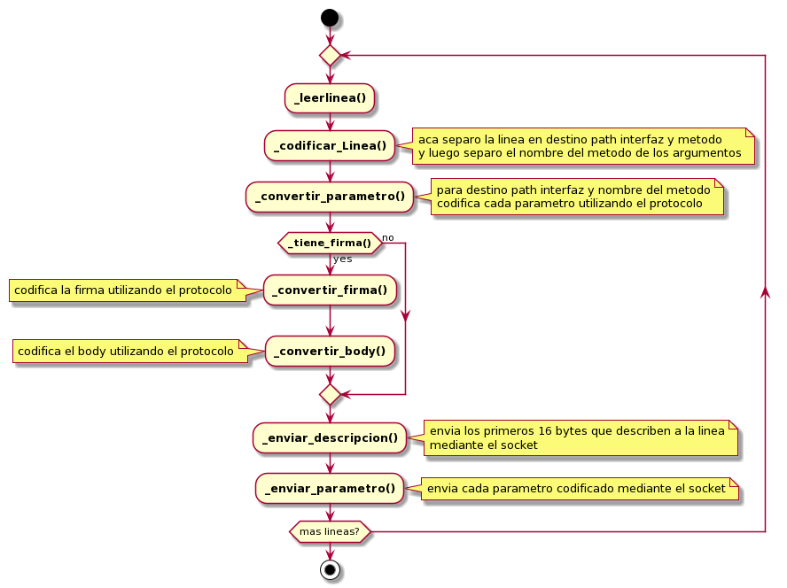

# Tp1
## Eleonora Luna Padron 96444

## Repositorio de Github https://github.com/eleonoraluna/tp1.git

## Informe

### 1. Arquitectura General

Para la solucion del trabajo practico se crearon los siguientes TDAs client, server y TCPsocket.
Tanto el cliente como el servidor tienen su propio main y hacen uso del TDA TCPsocket para 
comunicarse entre ellos.

### Cliente

El cliente es owner de un sockTCP_t que se conecta al servidor y le envía las distintas
llamadas implementando el protocolo establecido a traves del socket.
Se encarga de leer los datos a codificar a través de un archivo pasado por parámetro o 
sino por stdin. Lee de a lineas y codifica cada una y luego la envía a traves del socket
para que le llegue al servidor. Realiza esto hasta que se haya terminado el archivo y
cierra la comunicación. 

### Servidor

El servidor es owner de un sockTCP_t a través del cual recibe las llamadas codificadas
por el cliente y las decodifica implementando el protocolo establecido.
El servidor espera la conexión del cliente y por cada linea recibida imprime por
pantalla los datos pedidos. Luego de imprimir los datos de cada linea, le envia al cliente 
el mensaje "OK".El servidor termina cuando el cliente cierra el canal.

### TCPsocket

Este TDA representa un socket para protocolo TCP. Se encarga de recibir y enviar los 
buffers que le pasan por parámetros. Tambien se encarga de asegurarse que se envien y 
reciban todos los bytes correspondientes.

Podria haber sido interesante crear un TDA protocolo, pero la idea de que el protocolo fuese 
el owner del socket no terminaba de convencerme. 

### 2. Diagrama de la solución

Dado que la arquitectura general es bastante simple decidí hacer un diagrama de actividad
del cliente que fue la sección que me resulto más complicada de realizar y que puede
resultar un poco dificil de seguir. El siguiente diagrama muestra las distintas funciones por
las que pasa una linea leida del archivo hasta enviarse al servidor. Estos pasos se realizan por
cada linea hasta terminar el archivo.

